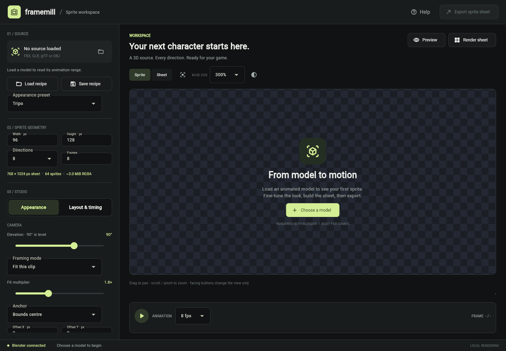
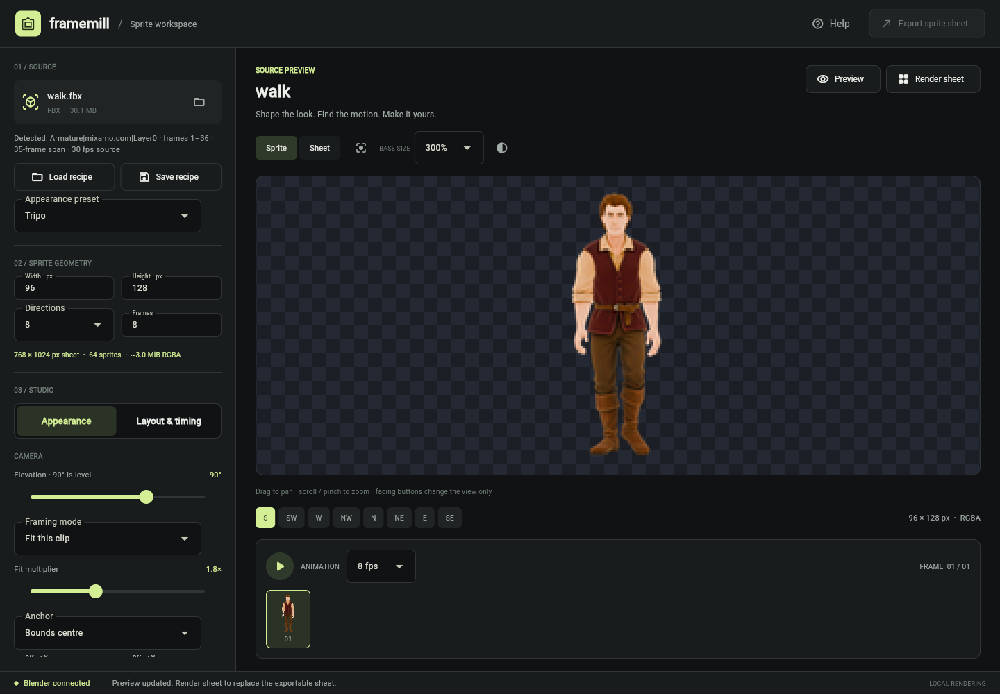

# framemill

Turn a rigged, animated **3D model into a directional 2D sprite sheet**, driven by Blender
in the background, wrapped in a small desktop app. **No Blender knowledge required.**

Point framemill at an animated `.fbx` / `.glb` / `.gltf`, choose how many directions and
frames you want, pick a preset, and get a game-ready sheet. It is built for the "I have a
Mixamo/Tripo model and want 8-direction sprites" workflow.



## Why

Most 3D-to-sprite tools are Blender add-ons: you install them inside Blender and learn its
UI. framemill is the opposite: a standalone GUI that runs Blender headless for you. The
fiddly parts (consistent camera framing across an animation, high-quality Lanczos
downscaling, sprite-sheet layout, legacy-engine TGA output) are handled for you.



## Features

- Standalone desktop app (Windows / macOS / Linux). Blender runs in the background.
- Import **FBX, glTF/GLB, OBJ**; 1 / 4 / 8 / 16 directions; configurable frames and dimensions.
- Automatic preview, sprite/sheet views, instant direction switching, and playback.
- Direction order, row/column layout, loop or one-shot sampling, source-range trim, phase, reverse.
- Optional root-motion removal that re-centers a travelling clip in every frame.
- Source-facing yaw, shared framing (fit or fixed world scale), anchors, and output offsets.
- Presets (**Generic PBR**, **Tripo**, **Mixamo**) plus full camera, lighting, and colour controls.
- Export dialog with a processed preview: **PNG / TGA / BMP**, 32/24/8-bit, alpha or colour-key
  backgrounds, edge bleed, dithering, and target presets.
- Master palettes: share a scene's exact indexed palette (a file or a fixed colour list) so
  8-bit sheets line up with a DOS-style shared palette, with the transparent key at index 0.
- Versioned portable recipes and an optional JSON animation-metadata sidecar.
- A searchable in-app Help browser documenting every control.

## Requirements

- **Blender 4.2+** installed (framemill auto-detects it, or point it at the executable once).
  Blender is not bundled; install it from [blender.org](https://www.blender.org/download/).
- For running from source: **Python 3.10+**.

## Quick start

Install with [pipx](https://pipx.pypa.io) (Windows / macOS / Linux):

```bash
pipx install framemill
framemill            # launches the GUI
framemill install-shortcut   # adds framemill to your application launcher
```

First time using pipx? Run `pipx ensurepath` once, then close and reopen your terminal so
the `framemill` command is on your PATH. On Windows, if `pipx` itself is not found yet, use
`python -m pipx install framemill` until you reopen.

`install-shortcut` adds a menu/launcher entry (a `.desktop` entry on Linux, an app bundle
on macOS, a Start Menu shortcut on Windows); `uninstall-shortcut` removes it. You can also
do it from the GUI with **Add to applications**.

Update with `pipx upgrade framemill`. A Linux **AppImage** and the wheel/sdist are on the
[releases page](https://github.com/ghreprimand/framemill/releases). Prefer to run from
source?

```bash
git clone https://github.com/ghreprimand/framemill
cd framemill
python -m venv .venv && source .venv/bin/activate   # Windows: .venv\Scripts\activate
python -m pip install -e .
framemill
```

Per-OS steps, update commands, and version pinning are in the
[installation guide](docs/installation.md).

## Documentation

Detailed docs live in [`docs/`](docs/README.md):

| Guide | What it covers |
| --- | --- |
| [Installation](docs/installation.md) | pipx, AppImage, or from source; per-platform install and update commands; Blender setup. |
| [Command line (CLI)](docs/cli.md) | `render`, `inspect`, `--version`, shortcut commands, and every flag. |
| [Settings reference](docs/settings-reference.md) | Every render and export control, its effect, and its default. |
| [Export and palettes](docs/export-and-palettes.md) | Formats, depths, backgrounds, and adaptive / master / fixed palettes, plus building a master palette. |
| [Recipes & metadata](docs/recipes-and-metadata.md) | The portable recipe file and the JSON metadata sidecar, field by field. |
| [Direction & orientation](docs/orientation.md) | The South-is-front convention, sheet order, and matching your engine. |
| [Architecture](docs/architecture.md) | How the model, Blender, compositor, and sheet pipeline fit together. |

The app also has a **built-in Help browser** (the Help button) with the same reference,
searchable, covering every control.

## Command line

```bash
framemill render walk.fbx -o hero --preset mixamo --angles 8 --frames 8 --format png,tga
framemill inspect walk.fbx
```

See the [CLI reference](docs/cli.md) for all commands and flags.

## How it works

```
model.fbx ──> Blender (headless, render_sprites.py) ──> per-angle PNG frames
                                                              │
                                                     compositor.py (Pillow)
                                                     crop → Lanczos → tile
                                                              │
                                                    sheet.png / sheet.tga / .bmp
```

More detail in [Architecture](docs/architecture.md).

## Contributing

See [CONTRIBUTING.md](CONTRIBUTING.md) for dev setup and testing notes.

## License

framemill is free software licensed **GPL-3.0-only**. See [LICENSE](LICENSE).

Copyright (C) 2026 Unfinished Works. You are free to use, study, share, and modify it. If
you distribute it or a modified version, you must pass on those same freedoms under the GPL
and make your source available; the GPL does not permit incorporating framemill into
proprietary, closed-source software.

framemill is part of **[Unfinished Works](https://unfinished-works.com)**.
